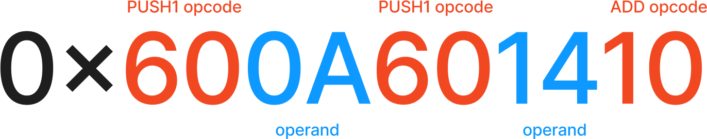

# Custom precompiles

## What is an Ethereum Precompile?

The generally accepted definition of an Ethereum precompile is “an extension of the EVM”, but what does that even mean? First, we have to understand what the EVM (Ethereum Virtual Machine) is at a conceptual level, and how precompiles fit into the picture.

### Bytecode, Opcodes, and the EVM

The EVM is a stack-based virtual machine which runs using bytecode, similar to the Java Virtual Machine. At its core, a **virtual machine** **is an executor of code**. In the context of Ethereum and other EVM chains, smart contracts are essentially the code that the EVM executes, and calls to invoke these contracts provide specific arguments for their execution.

**Bytecode** consists of opcodes (operation codes) and their operands. Let’s break this down. **Opcodes (operation codes)** are the instructions that tell the EVM what operation to perform. Each opcode is represented by a specific hexadecimal value (e.g. `0x600A601410`). **Operands** are the values that the opcodes operate on. They provide the data for the operations specified by the opcode. Think of opcodes as verbs (actions) and operands as nouns (things on which actions can be performed) in a sentence.

Here’s an example of two simple EVM opcodes:

* The `60` opcode represents `PUSH1`, an operation that pushes one item onto the stack. The byte immediately following this opcode is its operand, the value that will be pushed.
* The `01` opcode represents the `ADD` operation, which sums two numbers.

Consider the earlier bytecode example, `0x600A601410`. We can “disassemble” this bytecode, which means converting it from machine-readable format to a more human-readable form.

```nasm
PUSH1 0x0A ; Opcode 60 (PUSH1), operand 0x0A (decimal 10)
PUSH1 0x14 ; Opcode 60 (PUSH1), operand 0x14 (decimal 20)
ADD        ; Opcode 01 (ADD), top two stack items are the operands
```

This translates to, “add the numbers 10 and 20 together”.

<figure><figcaption></figcaption></figure>

The full list of opcodes can be found here: [https://www.evm.codes/](https://www.evm.codes/). Among these operations, `CALL` is particularly important. The `CALL` opcode allows the execution of another smart contract by taking the target address as a parameter.

### Simplifying Complex Operations

While the EVM's basic operations (opcodes) are expressive, sometimes developers need to perform complex tasks without managing all the intricate details. This is where the concept of "higher-level functionality" comes in.

Think of it like driving a car. As a driver, you don't need to understand or control every aspect of the engine's operation. You simply use the steering wheel, pedals, and a few buttons. The car's complex systems are abstracted away, providing you with a simple interface to operate the vehicle.

Similarly, in Ethereum, developers often need to perform complex calculations or use cryptography algorithms that would be impractical to build from basic opcodes. Examples include sha256 hashing or elliptic curve operations. Precompiles offer a way to use these complex operations through a simplified interface, much like how a car's controls allow you to drive without worrying about the engine's inner workings.

### Enter Precompiles

From an external user's perspective, precompiles feel like smart contracts - they have addresses, and you can call them just like you would call a regular smart contract. However, under the hood, precompiles run pre-compiled logic instead of executing a smart contract's bytecode.

Precompiles are available at specific addresses like normal contracts, starting from the `0x01` address. For example, the `0x02` address is the SHA256 precompile ([https://www.evm.codes/precompiled](https://www.evm.codes/precompiled)). When a contract calls one of these precompiles (uses the `CALL` opcode), it’s not actually calling another smart contract, but rather invoking a built-in function of the Ethereum client.

### Benefits of Precompiles

1. **Predetermined Gas Costs**: Precompiled contracts also have pre-determined gas costs, which makes it cheaper for developers to use precompiles over their own implementation, and makes it easier to predict how much a transaction will cost.
2. **Native Implementation**: Precompiles are implemented by the execution client. For example Geth implements precompiles as a Golang function. When the `CALL` opcode is executed, Geth [first checks if the target address is a precompile address](https://github.com/ethereum/go-ethereum/blob/v1.10.26/core/vm/evm.go#L215), and if so, runs a custom Golang function.
3. **Performance:** Running a precompiled contract in a compiled language like Golang is much more efficient than executing it as an EVM opcodes, because we can take advantage of all the language compiler optimizations for the local platform. Hence, precompiles not only **reduce gas costs, but also shorten transaction execution time**.

### Custom Precompiles

Here at Nibiru Chain, we support all of the standard Ethereum precompiles ([https://www.evm.codes/precompiled](https://www.evm.codes/precompiled)) as well as custom precompiles that we built in-house for our users. Our custom precompiles allow users to:

* convert ERC-20 tokens to native Cosmos coins
* send assets over IBC
* interact with CosmWasm smart contracts
* stake and liquid stake from the EVM
* vote on governance proposals
* and much more!

The custom precompile design space is practically unbounded because the implementation is written in the execution client’s native language (Golang) and has access to the entire blockchain state. You can read more about Nibiru Chain’s EVM implementation at [https://nibiru.fi/docs/evm/](https://nibiru.fi/docs/evm/) and follow us on X ([https://x.com/nibiruchain](https://x.com/nibiruchain)) for the latest announcements regarding our EVM deployment.

### Conclusion

EVM precompiles are extensions of the EVM. Precompiles are pre-defined subroutines available at static addresses, offering functionality that goes beyond what can be achieved with basic opcodes, such as cryptographic hashing or elliptic curve operations.

EVM precompiles offer greater gas efficiency, faster runtime, and simplicity. Developers should leverage precompiles when given the opportunity to do so.
